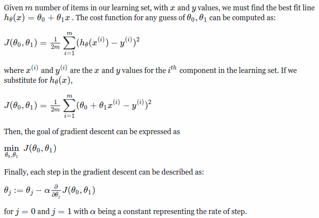
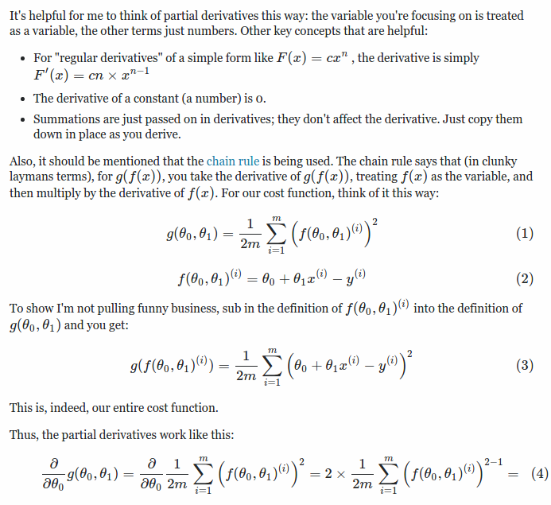
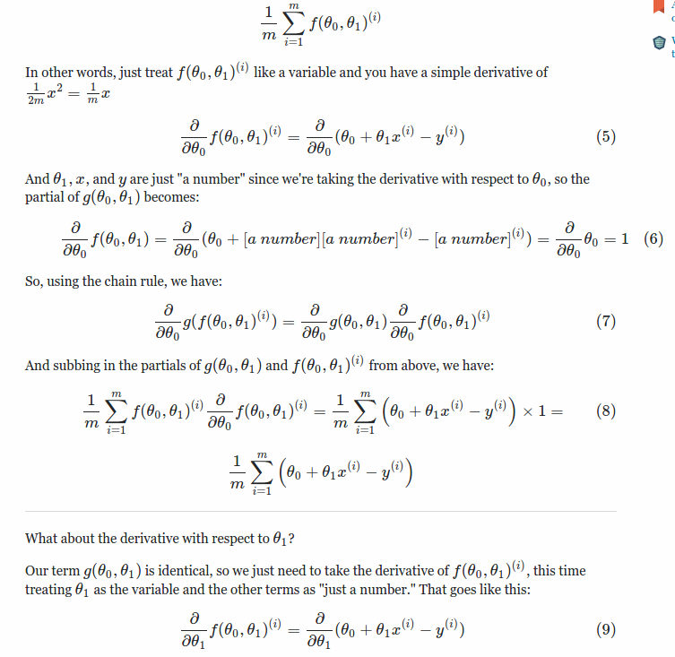
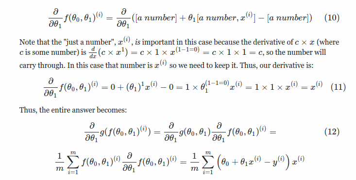

## Introduction to gradient descent

Okay so generally in machine learning you have some training dataset on which you are supposed to build a model so as to predict or classify some properties learned from the dataset.

For which we have some terms called parameters which are basically forms you the **mathematical model or hypothesis equation**. There can be multiple hypothesis equations for different parameters producing different output. But we are interested in one such hypothesis equation which will best fit our dataset in the perfect manner in order to make real-time decision.

> Now comes the question of how can we find our optimum model for that we have **cost functions**.

A cost function basically is way to determine how accurate your model is or if I put it better way it tells you difference between your models output and the desired output. We basically want our cost function to be zero, in other ways we can say that we want to minimize our cost function.

As the parameters increases the model becomes more complex and the combinations of parameters also increases exponentially. In this case it would be really difficult to try out all the model outputs and determine the **local minimum**.

So people felt there's a need for a software or an algorithm which can automatically take us to the local minimum, that's when **Gradient descent** came into picture.

Gradient descent basically decreases or increases the values of the parameters of your model in order to reach the local minimum faster without trying out values of all the parameters (which would be a huge combination), so the gradient descent uses a **learning rate (alpha)** which basically is a multiplier which lets you reach the local min faster.

> Selection of a smaller value will lead to local minimum slower or a higher value will lead to oscillation of the final cost functions.

## Main Formulas

Below are the list of formulas which is developed in the DeepRust project.

**Mathematical derivations**

The below derivations are how we arive at the mathematical formulas above.

Ref:
* [Derivation](http://math.stackexchange.com/questions/70728/partial-derivative-in-gradient-descent-for-two-variables)

## Stochastic gradient descent (TBC ..)

Ref:
* [Difference between SGD and GD](https://www.quora.com/Whats-the-difference-between-gradient-descent-and-stochastic-gradient-descent)
